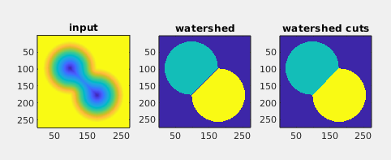

An implementation of the surprisingly simple $`O(n)`$ watershed
algorithm from Cousty et al. [^1].

The code in this repo is for images only and uses 4-connectivity in 2D and
6-connectivity in 3D. The algorithm is more general than that, and is
presented in the framework of undirected graphs.

There are a few choices to make, one of them is how to define the
function on the edges, $`F(\{x,y\})`$ where $`\{x,y\}`$ denotes the
connecting vertex $x$ and $y$.

This implementation uses

``` math
F(\{x,y\}) = \min \left( I(x) , I(y) \right)
```

while another suggested option was

``` math
F(\{x,y\}) = | I(x) - I(y) |
```

which has the property that it locates the boundaries of the watershed
regions along image edges.

## Performance
An obvious difference to the standard watershed methods is the lack of
contours or watersheds between labeled regions. The actual boundaries
are on the graph edges, i.e., between the pixels.

Below is an example image demonstrating the differences in output from
the **watershed**[^2] method bundled with MATLAB. In the bottom-right
image boundary pixels are artificially introduced (pixels set to 0
when they differ from the erosion by a small structuring element, see
**matlab/test_watershed_cuts.m**).


Here is another example, borrowed from the documentation of
**watershed** showing the result of watershed cuts to the right.




A quick benchmark on images of size $`\left[n \times n\right]`$
reveals that watershed cuts are as fast as advertised. Also much
faster than methods typically in use. In the table below it is
compared to the watershed implementation in MATLAB R2020b, and the one
in scikit-image [^3]. Exactly the same image was used when comparing MATLAB
to this implementation. For scikit-image similar, but not identical,
images were used (see **python/benchmark_scikit-image.py**).

| n     | watershed [s] | scikit-image [s] | this [s] |
| ---   |    ---        |     ---          |   ---    |
| 256   |  0.014        |   0.018          | 0.0011   |
| 512   |  0.061        |   0.09           | 0.0036   |
| 1024  |  0.26         |   0.73           | 0.016    |
| 2048  |  1.8          |   5.5            | 0.76     |
| 4096  |  9.8          |  32              | 0.33     |
| 8192  | 49            | 170              | 1.3      |
| 16384 | 270           |                  | 5.8      |
| 32768 |               |                  | 24       |

## TODO
- [ ] Test it a little more
- [ ] Explore the options
- [ ] What is there in DIPlib [^4]?

## References

[^1]: Cousty, Jean and Bertrand, Gilles and Najman, Laurent and Couprie, Michel, Watershed Cuts: Minimum Spanning Forests and the Drop of Water Principle, IEEE Transactions on Pattern Analysis and Machine Intelligence, 2009 31(8), pp 1362-1374, [doi:10.1109/TPAMI.2008.173](http://dx.doi.org/10.1109/TPAMI.2008.173) see also [https://perso.esiee.fr/~coustyj/]
[^2]: [MATLAB watershed documentation](https://se.mathworks.com/help/images/ref/watershed.html)
[^3]: [scikit-image documentation on watershed](https://scikit-image.org/docs/stable/api/skimage.segmentation.html#skimage.segmentation.watershed) there is also a [demo](https://scikit-image.org/docs/stable/auto_examples/segmentation/plot_watershed.html)
[^4]: [DIPlib watershed documentation](https://diplib.org/diplib-docs/segmentation.html)
